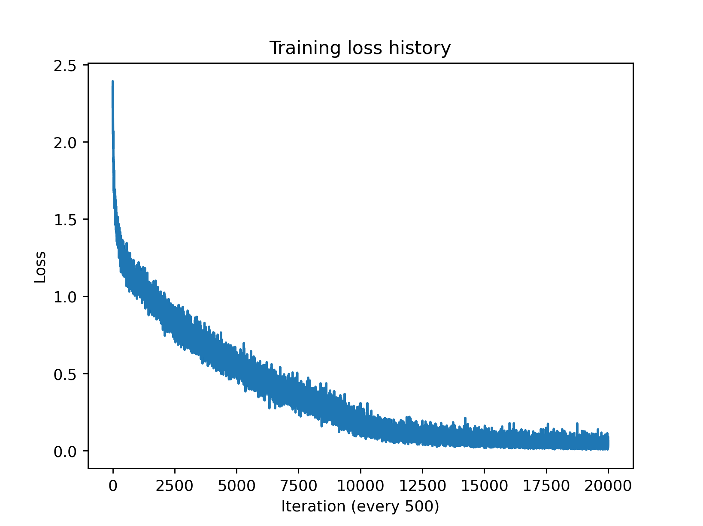

# Transformer Playground
A transformer and a mini-GPT implementation under PyTorch framework.

### Train the model to learn multiplication. 
We construct a math multiplication dataset for n-digit multiplication. Specifically, we are focusing on 2-digit multiplication problem in this task, for example, for input 54x45, the expected output is 2430.



### Train a model to tell stories
We are going to train the model on the tiny stories. Please open the link, download the TinyStories-train.txt file, and put it in your data folder like below.
```
HW4 /
--| transformer.ipynb
--| data /
----| TinyStories-train.txt
----| ...
```

In early iterations, the model will not generate anything meaningful, but as you train the model for more iterations, you will gradually see some interesting stories. The stories can be imperfect because we are only running a small model, but it should generate real words mostly, and follow grammar rules to some extent. Feel free to run it for longer (increase max_iters) or make the model size larger if you have time and want better results, but the default setting should be good enough.

Here are some generated texts during training:
1. Iteration 501/15000: training loss 1.7922
- Story (1): 
Once upon a time hin bom the motind, "I walle pat a and it, be a look too cher an to and the soul. They saw saw the their to proce to the ime to soma. She ad and trie it to boulte. She the a days to the whing so pok it. She they hownthin's to her. He der was was terir sarked tlit bootat ithat twe at fun it and ware forended she outher. Her did ad sallled and Tis the comeltele, "Doved buron, "Lily't, her she cacyir to but flig therat a shir shomed thid. The art bane, anve bry happy her was shey with belit fins flird thens in alllings theim in now toge soons. "Wan, hey as at goo therar, I downe aver the ats and and wat they cad bill theis, she sploot to tich becat igh thor they. He domm they dad bon the she said and shie. She aned the sort as in it then togart.

- Story (2): 
Once there was an take. It, "Why bolelle we the to pry!"

- Story (3): 
One day, he heave a she clooooth her butle the pil bear the cat shellle. They we tho the they felt. It was shey bich is the wie fat fors fil. She he hear hey had lay shee betig the walfoll she and and he fof and.
Her she saw to sitede with was to the go theirtth and hage bot ir sthe tore.
Lily "Lily, "Lely wis's, he shit hit tat ir her an alll skeated. 
Bunly here want souck and Somalld the the touet.
They scared as aid "Tim sthe was and the bor icith."
She wim bigl lovens it but it and "Lut to am the sant longath Thim, "Lou," Then dome lanet and big, Sheche and his and live an saw the that bit to hes atingede. They the dot claver they. The my sared tid sogld out the hel the gigar in. They litle wile. They hey saw sot diggl. 
She smaid, The s at and santes Sane. Hent sad shirrr, "Yeam. "Le lookled to the sto cat tat welke to take boy."
Lily dampp werees tollt frated. They loty they wigh all agro brom.
The helt bill there arake! He they was hitan ifomm. "I dou d and hellp tooo the ipp to tire stometh int in then brat


